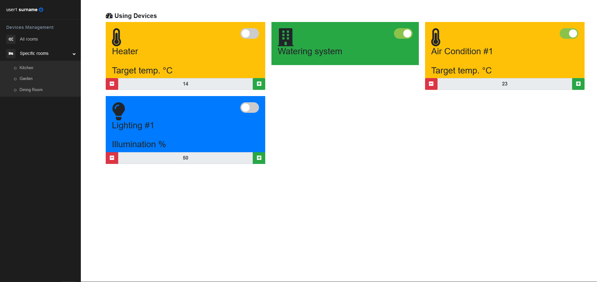
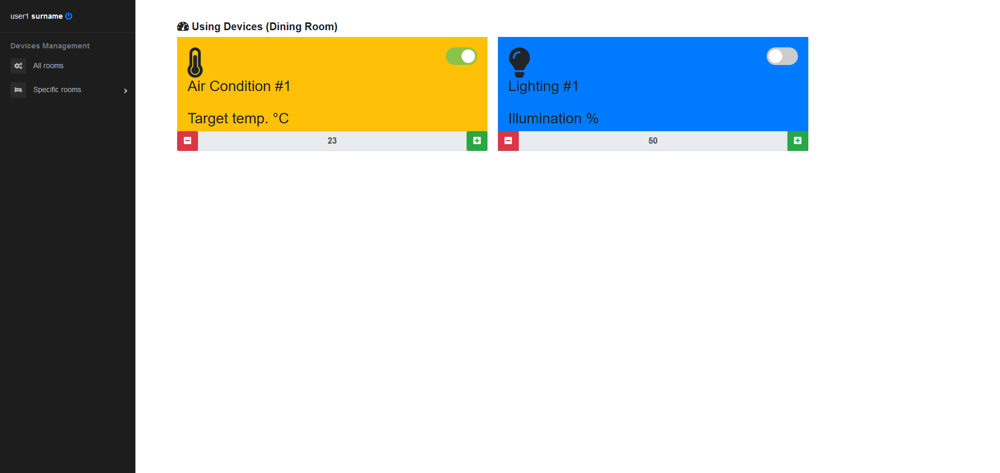
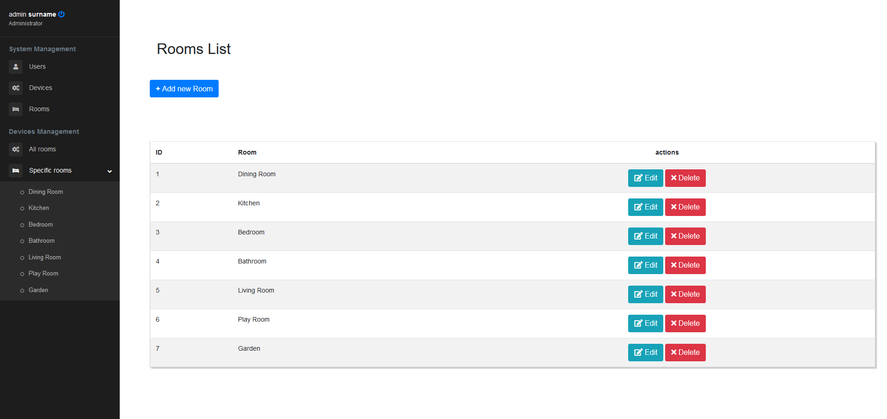
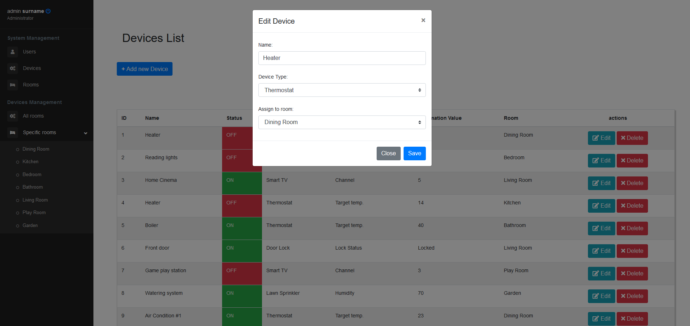

# HomeAutomation
A web-based project implemented as part of the Coding School (10 daily-sessions training) during March-April 2018.
It was implemented using Spring Boot.

# Purpose
HomeAutomation is a virtual platform that collects all home devices that can connect to the internet. It enables us to interact and control them remotely.

Sign-up and log-in functionalities ensure the security of the application.
The platform supports 2 different roles of users: Admins and simple Users. Each role is granted specific permissions.

The main functionalities provided are:
* Each user can view a list with all the devices they can control
* They can only interact with their assigned devices by changing a device metric (e.g. temperature) or turn it on/off
* Administrators can also do the following:
    * view a list of all users and update/remove users
    * view a list of all devices and add/remove/update devices
    * view a list of all rooms where devices reside and add/remove/update rooms
    * interact with all devices

# Screenshots
Displaying all rooms where a simple user has access:

Displaying devices accessible to a simple user for a specific room:

Admin has access to the room details of the house:

Admin can control any device in any manner:

# Prerequisites
* Java 8 (JDK) installation
* Spring Boot 2.0.1.RELEASE
* MySQL (5.7.21 was used) 
* Maven (3.5.3 was used)

# Build and Test the application
1. Open `application.properties` and verify that any placeholders are substituted with actual values
2. Open any terminal or command line prompt
3. Navigate to the provided project folder `HomeAutomation`
4. Run
	`mvn clean install`
	
	This will download any necessary artifacts from maven central repository, build the project and run the whole unit test suite and install the application in the local maven repository.
	
5. Alternatively, run
	`mvn clean test`
	
	This will skip installing the application in the local maven repository.

# Run the application
1. Open a new terminal or command line prompt
2. Navigate to the provided project folder `HomeAutomation`
3. Run
	`mvn spring-boot:run`
	
	This will deploy the application and start the Web Application server.
	
4. Access application through browser:

	http://localhost:8080/homeAutomation/

# Troubleshooting
If you experience issues such as `java.lang.ClassNotFoundException: javax.servlet.Filter` during the startup of the
application then it may be caused to configuration of your IDE. 

For instance, check [this StackOverflow post](https://stackoverflow.com/a/71499813) on how to overcome this issue on
IntelliJ IDEA.